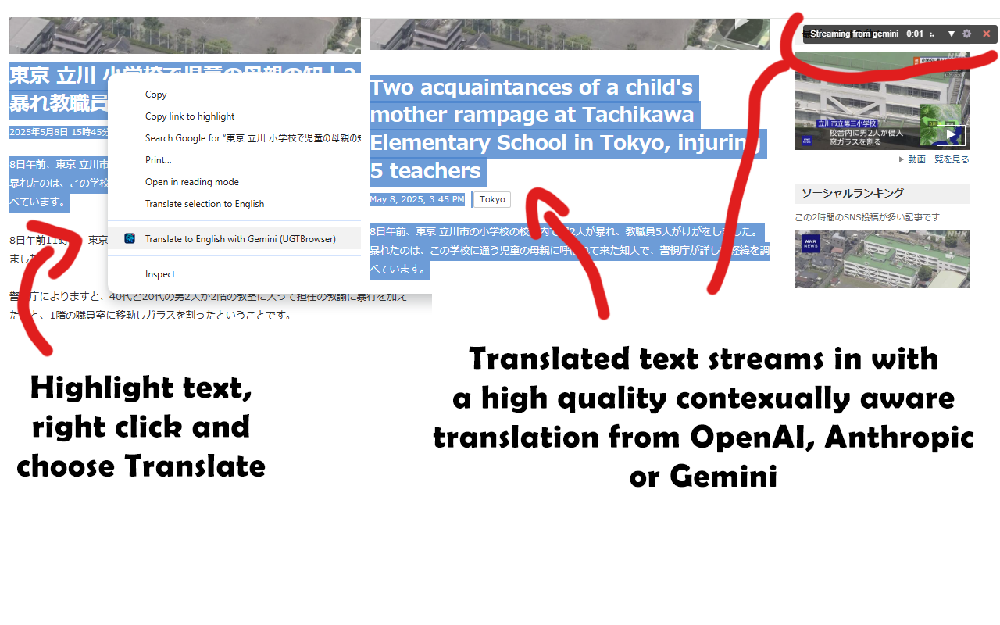
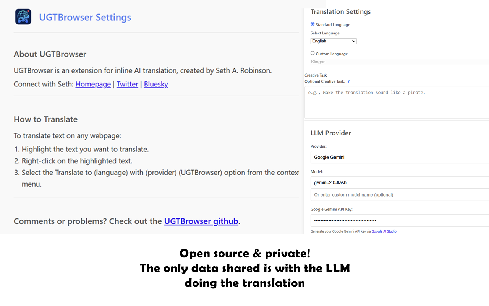

  

# UGTBrowser - Universal Game Translator Browser Extension

UGTBrowser is a Chrome extension that allows you to translate highlighted text on any webpage using your own API keys for various Large Language Model (LLM) providers.
 

  
  

 
Also check out [UGTLive](https://github.com/SethRobinson/UGTLive) (Good at translating live video/audio)

## Why tho

Why did I make this? Because the default translate option in Chrome makes *MANY MISTAKES* with Japanese to English.

Using the best AI models lets you choose quality over speed - when researching old game blogs and such, it's totally worth it.

I use a text-fragment approach that lets the LLM understand the full context (all fragments are sent at once and in order), but still allows us to do a streaming translation with in-place text replacement that doesn't mess up links and images.

*WARNING:* This extension is free and open source, but the LLMs actually cost money and generally make you put in a credit card to get an API key and charge per use.  So just be aware that it can add up.  Try Gemini, for example; the first million tokens per month are free.

Note:  I used "UGT" in the name because I might add more game-specific features later, so it's more like its [big brother](https://github.com/SethRobinson/UGTLive) project.

## Features

*   Translate selected text using the latest LLM models (Open, Anthropic, Google)
* Support for a secondary "Creative task", for example, summarize everything into a poem at the end or explain cultural notes.
*   Securely stores your API keys and settings locally in your browser. These are not synced with the cloud or other devices.
*   Nothing is sent out except the text to the LLM providers you're using.
*   Customizable prompt template for advanced users.
*   Context menu integration for easy access.
*   During translation, a little animation is shown with an option to see the text coming in.
*   There is a way to see the last prompt/response pair in the settings, good for debugging.

## AI Disclosure

This project was developed with significant assistance from AI tools.  I mean, you can still blame me (Seth) for bugs, but I just wanted to mention it.

## Download & Installation

### Installing from the Chrome Store

1.  **Download:** (Link to Chrome Web Store to be added later)
    *   (Recommended method for most users)

### Installing Manually (for development or offline use)

1.  **Download:** Download the latest version directly from GitHub: [https://github.com/SethRobinson/UGTBrowser/archive/refs/heads/main.zip](https://github.com/SethRobinson/UGTBrowser/archive/refs/heads/main.zip).
    *   This will download a file like `UGTBrowser-main.zip`.
2.  **Unzip the file:** Extract the contents of the downloaded ZIP file to a folder. This will create a folder typically named `UGTBrowser-main` (or similar, depending on the branch name).
3.  **Enable Developer Mode in Chrome:**
    *   Open Chrome and navigate to `chrome://extensions`.
    *   Toggle the "Developer mode" switch in the top right corner.
4.  **Load the Extension:**
    *   Click on "Load unpacked".
    *   Select the unzipped folder (e.g., `UGTBrowser-main`) that contains the `manifest.json` file.

## How to Use

1.  Highlight the text you want to translate on any webpage.
2.  Right-click on the highlighted text.
3.  Select "Translate to (language) with (provider) (UGTBrowser)" from the context menu.

## License

This project is licensed under the MIT License. See the [LICENSE](LICENSE) file for details.

## Privacy

Your privacy is important. UGTBrowser does not collect or store any personal data on its own servers. API keys and all settings are stored locally in your browser using `chrome.storage.local` and are not synced across devices. For more details, please see our [Privacy Policy](privacy_policy.md).

## Todo

* Make it work in Firefox - I tried to convert it using `browser-polyfill.min.js`, but it didn't work, so maybe later.
* Possibly add other features its big brother UGTLive can do.

## Bugs/Limitations

* For security reasons, Chrome doesn't allow extensions to translate certain pages, such as those starting with `chrome://`. This is unfortunate because it means Chrome's reader view can't be translated by this extension.
* Be aware that some models, like Gemini 2.5 Pro, are slower-thinking models, and it could take *minutes* to process a large translation.  Stick to Flash/Mini/Turbo models instead unless you REALLY value quality over speed.

## Credits

UGTBrowser is created by Seth A. Robinson.

Connect with Seth:

*   [Homepage](https://www.rtsoft.com/)
*   [Blog](https://www.codedojo.com/)
*   [Twitter](https://twitter.com/rtsoft)
*   [Bluesky](https://bsky.app/profile/rtsoft.com) 