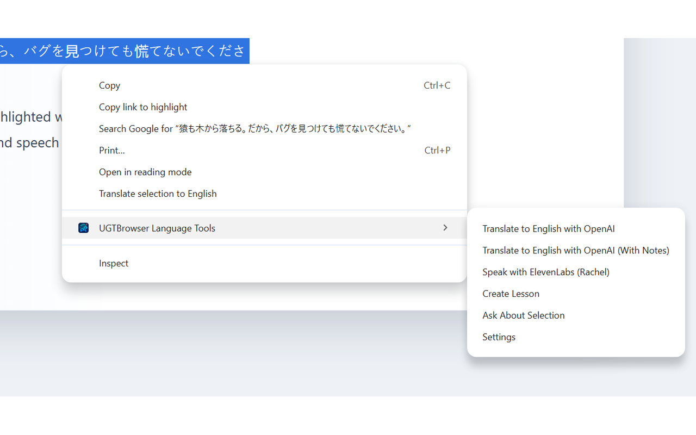
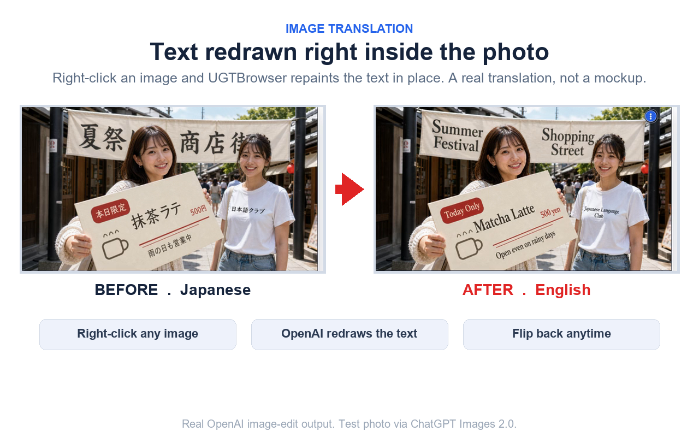
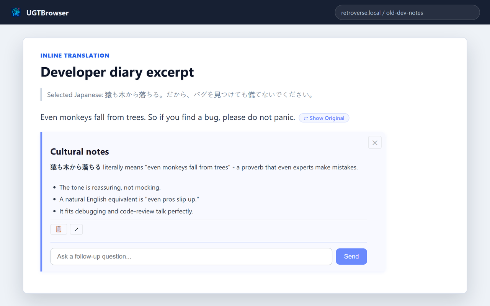
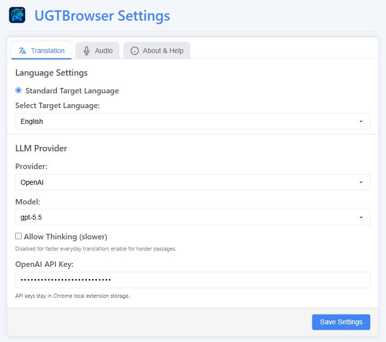

  

# UGTBrowser - Universal Game Translator Browser Extension

A Chrome extension that translates highlighted text, images, and video frames, and can speak text aloud using your own AI provider keys (OpenAI, Anthropic, Google, ElevenLabs).

## AI Agent Instructions

If you are an AI agent working on this repo, read [AGENTS.md](AGENTS.md) first. It contains the high-level project map, extension architecture notes, image translation implementation details, and maintenance rules for keeping agent-facing context current.

# [Install from Chrome Web Store](https://chromewebstore.google.com/detail/ugtbrowser/ccpaaggcacbmdbjhclgggndopoekjfkc)

### Manual Installation

Useful if the Chrome Web Store hasn't updated to the latest version yet:

1.  **Download:** [https://github.com/SethRobinson/UGTBrowser/archive/refs/heads/main.zip](https://github.com/SethRobinson/UGTBrowser/archive/refs/heads/main.zip)
2.  **Unzip** the file to a folder
3.  **Enable Developer Mode** in Chrome at `chrome://extensions`
4.  **Load unpacked** and select the unzipped folder containing `manifest.json`

## Features

* **Translate** - High-quality AI translation that streams in-place and explains cultural context
* **Image Translation** - Right-click webpage images and replace them with translated PNG results. Experimental, and currently takes about 30-40 seconds per image.
* **Video Frame Translation** - Translate a still frame from a visible video without capturing the stream
* **Text-to-Speech** - Have text read aloud via ElevenLabs or Google Cloud TTS
* **Create Lesson** - Generate detailed language breakdowns with readings, meanings, and grammar notes
* **Follow-up Chat** - Ask questions about the translated content

  

  

  
  

## How to Use

1. Highlight text, right-click an image, or right-click a visible video frame on any webpage
2. Select the matching action from the UGTBrowser menu
3. Use the follow-up chat, preview, or flip controls as needed

## Why tho

Why did I make this? Because the default translate option in Chrome makes *MANY MISTAKES* with Japanese to English.

Using the best AI models lets you choose quality over speed - when researching old game blogs and such, it's totally worth it.

I use a text-fragment approach that lets the LLM understand the full context (all fragments are sent at once and in order), but still allows us to do a streaming translation with in-place text replacement that doesn't mess up links and images.

*WARNING:* This extension is free and open source, but the LLMs actually cost money and generally make you put in a credit card to get an API key and charge per use.  So just be aware that it can add up.  Try Gemini, for example; the first million tokens per month are free.

Note:  I used "UGT" in the name because I might add more game-specific features later, so it's more like its [big brother](https://github.com/SethRobinson/UGTLive) project.

## AI Disclosure

This project was developed with significant assistance from AI tools.  I mean, you can still blame me (Seth) for bugs, but I just wanted to mention it.

## Version History

**v2.2.0** (Current)
* Added support for GPT-5.5 and Claude Opus 4.8 models
* Added "Translate Only" option for quick translations without cultural notes
* Added customizable image translation prompt setting
* Clarified separate provider settings for text and image translation
* Fixed concurrent image translation handling and now surface errors on the page

**v2.1.0**
* Added image translation with in-place replacement, preview, and original/translated flip controls
* Added still video-frame translation overlays

**v2.0.0**
* Added Text-to-Speech support (ElevenLabs and Google Cloud TTS)
* Added Create Lesson feature for detailed language breakdowns
* Added Follow-up Chat to ask questions about translated content
* Lots of misc tweaks and fixes

**v1.0.x**
* Initial public release with core translation functionality

## Privacy

API keys and settings are stored locally in your browser only. Nothing is sent except text to your chosen LLM provider. See [Privacy Policy](privacy_policy.md).

## License

MIT License - see [LICENSE](LICENSE).

## Credits

Created by Seth A. Robinson - [Homepage](https://www.rtsoft.com/) | [Blog](https://www.codedojo.com/) | [Twitter](https://twitter.com/rtsoft) | [Bluesky](https://bsky.app/profile/rtsoft.com)
